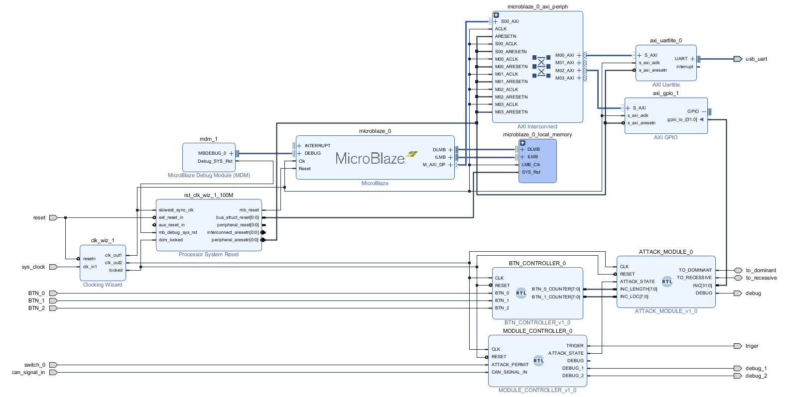
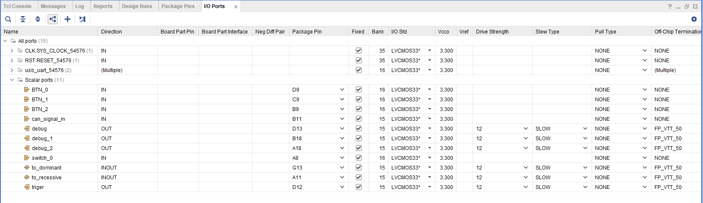
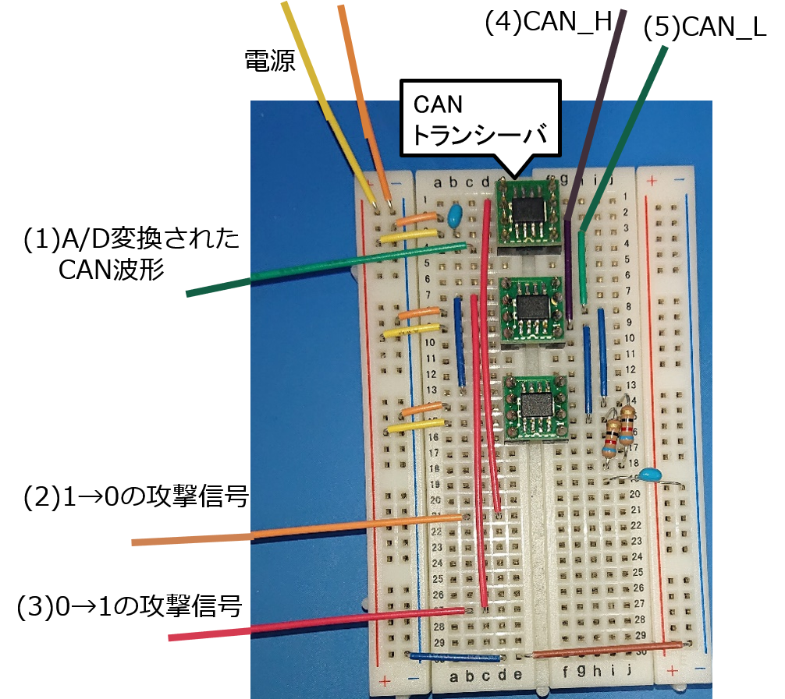

# CAN FDにおける電気的データ改ざんプログラム

CAN FDに対して電気的データ改ざんを行った際の攻撃ツールのArty内のプログラム。Vivado 2018.3

## 概要

IDをパラメータとしてプログラムに記述することで、攻撃対象メッセージが送信された場合に、攻撃信号の出力を行う。攻撃対象メッセージのID部分でトリガーを出力し、カウンタを回し始める。攻撃信号を出力するタイミングはカウンタの値で指定する。

## モジュールの説明


上半分のモジュールはUart通信でPCの画面上に出力させるためのものだが今回は使っていないので無視する。（なくても動く）SDKについては[このサイト](https://fpgafpga.jimdofree.com/ホーム/vivadoでmicroblaze/vivadoでmicroblaze-導入編/)を参照。コピーしたプロジェクトなので使っていないプログラムもフォルダ内に入っている。<br>以下4つのモジュールについて説明する。

-   clk_wiz<br>
    クロック生成モジュール
    
- BTN_CONTROLLER<br>

  BTN_0～1の入力によりカウンタをインクリメント・デクリメントするモジュール。電位差操作部の位置・幅調整に使用。電位差操作位置をパラメータとしてプログラム内に記述する方法だと、いちいちgenerate bitstreamしなければならず時間がかかるため実装した。

-   MODULE_CONTROLLER<br>
    攻撃対象メッセージの判定などを行っているモジュール群。
    
    -   TIMING_CONTROLLER<br>攻撃ツールがバス上をサンプリングするタイミングを計算するモジュール。$2 \mu s$(1bit)ごとに立つトリガ(SP_TRG)を生成。
    -   BUS_MSG_OBSERVER<br>
        バスの波形を一定時間ごとにサンプリングしてビットの値を配列に格納するモジュール。
    -   STATE_DETECTOR<br>
        バス上の状態を判別するモジュール。メッセージフレームが流れているかどうか。
    -   MSG_FILTER<br>
        攻撃対象メッセージの判定を行ない、トリガを出力。また、攻撃スイッチがONであれば攻撃用のトリガーも出力する。このトリガが立っていれば、攻撃回路が回る。
    
-   ATTACK_MODULE<br>
    攻撃信号を出力するモジュール。攻撃対象メッセージが送信され、トリガーが立った時点からカウンタを回し始める。攻撃信号出力タイミングはカウンタで指定する。

## I/O Port

プロジェクトをコピーするとこの設定がよくバグるので注意。その場合は以下の画像のように設定しなおす。


-   入力信号
    -   BTN_0, BTN_1, BTN_2<br>
          Arty上のボタンの入力
    -   clk<br>
          クロック入力100MHz
    -   can_signal_in<br>
          CANトランシーバでA/D変換された信号を入力
    -   switch_0<br>
          Arty上のSW0の入力
-   出力信号
    -   triger<br>
          オシロ用のトリガ。攻撃対象メッセージが来たら出力。
    -   to_dominant<br>
          1→0の攻撃信号。何もしない時はリセッシブ、電位差操作時はドミナント。
    -   to_recessive<br>
          0→1の攻撃信号。
    -   debug, debug_1, degbug_2<br>
        デバッグ用のポート

## 使用方法

1.  環境を整える<br>
   まず、攻撃対象のネットワークを構成する必要がある。修論の実験ではCANoeを用いてネットワークを構成している。VN1630AにはCANのポートが2つあり、一方を送信側、他方を受信側としている。ハブなどを使用しそのCANバスに攻撃ツールを接続する。実験時のCANoe設定ファイルはCANoeConfigフォルダに入れてある。

2.  攻撃対象メッセージのID指定<br>MSG_FILTER.v :<br>
    TARGETに攻撃対象メッセージのIDを指定する。ID内にスタッフビットが入る場合にはそれも含める。<br>
    
    ```verilog
    parameter TARGET = {96'b1,1'b0,11'h19a}; //id:0x19A
    ```
3. 電位差操作位置指定<br>ATTACK_MODULE.v:<br>

   以下のように電位差操作位置をcounterの位置で指定する。recessive <= 0;で0→1の攻撃信号出力、recessive<=1;で終了。実験環境が少しでも違うと(機器の個体差など)、同じタイミングでは攻撃できない可能性があるため、このプログラムのタイミングではできないかもしれない。

   ```verilog
   always @(posedge CLK) begin
           if(~RESET) begin
               dominant <= 1;
               recessive <= 1;
           end else begin
               case(counter)
                   //再同期
                   16'd615: begin
                       recessive <= 0;
                   end
                   16'd625/* - {8'b0, INC_LOC}*/: begin
                       recessive <= 1;
                   end
   ```

4. generate bitstream<br>

   vivadoでビットストリームを生成しArtyに書き込む。

5. スイッチON<br>

   Arty上のSW0を切り替えると攻撃が始まる。

6. ３、４の工程を攻撃が成功するまで繰り返す。

## 攻撃回路
Arty周りの回路についての説明。(1)(2)(3)はArtyの対象のポートにつなぐ。(4)(5)は攻撃対象のCANバスに接続する。しましまの抵抗とかはノイズを除去する為のもの。先輩たちから受け継がれてきたものなのであまり理解していない。

<div style="text-align:center;">

</div>
